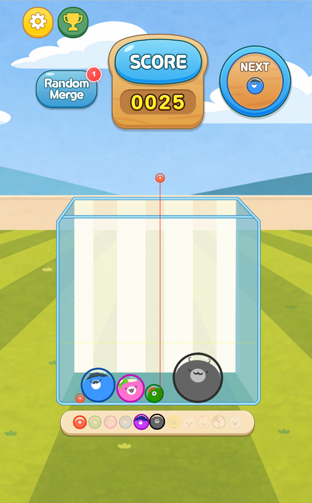
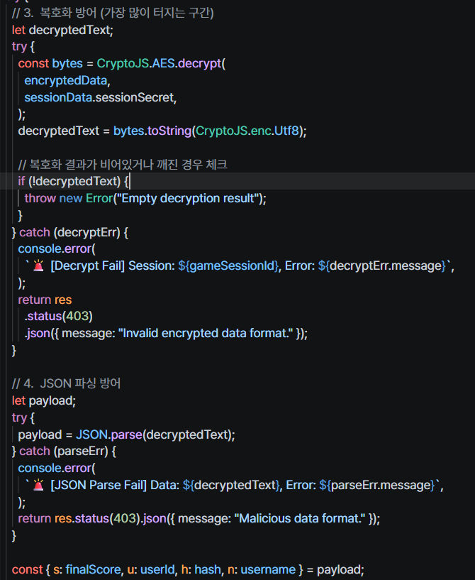
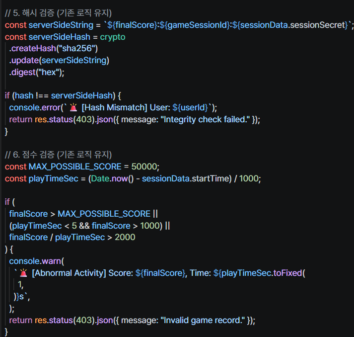
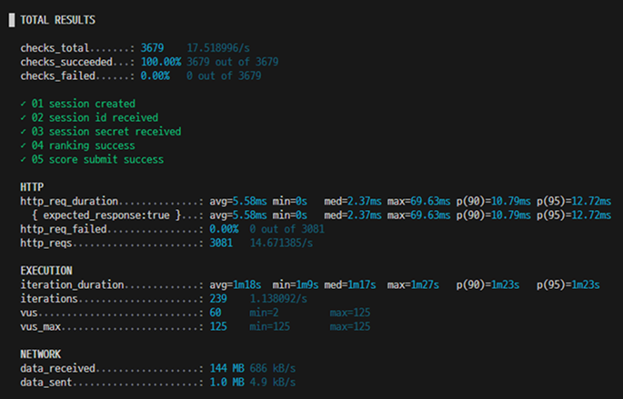
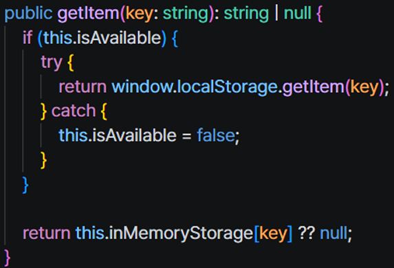

# Suika Game

캐릭터를 떨어뜨려 같은 캐릭터끼리 합치고 더 높은 점수를 만드는 웹 기반 캐주얼 게임입니다.

단순한 게임 구현에서 끝내지 않고, 사내 이벤트에서 실제 사용자가 플레이하는 환경을 기준으로  
**게임 개발 → 서버 연동 → 운영 → 안정성 및 보안 개선 → 부하 검증**까지 진행했습니다.

> TypeScript 기반 웹 게임으로 PC 및 모바일 브라우저, Android WebView 환경을 지원합니다.

---

## 게임 설명

마우스 또는 터치로 캐릭터를 떨어뜨릴 위치를 결정합니다.

같은 종류의 캐릭터가 충돌하면 다음 단계의 캐릭터로 합쳐지며 점수를 획득합니다.  
다음에 등장할 캐릭터를 확인하면서 공간을 관리하고 최대한 높은 점수를 만드는 것이 목표입니다.

### 플레이 방법

1. 마우스 또는 터치로 캐릭터의 위치를 결정합니다.
2. 입력을 해제하면 캐릭터가 떨어집니다.
3. 같은 캐릭터끼리 충돌하면 더 큰 캐릭터로 합쳐집니다.
4. 캐릭터가 상단 제한선을 넘지 않도록 배치하며 최고 점수에 도전합니다.

---

## 🛠 Tech Stack

### Client

- TypeScript
- HTML5 Canvas
- CreateJS / EaselJS
- Matter.js
- CryptoJS

### Server (Legacy)

- Node.js
- Express
- SQLite

### Test

- k6

### Current Data Layer

- Firebase / Firestore

---

## 코드 읽는 순서

실행 프로젝트는 [game](./game/) 폴더에 있습니다. 코드 전체보다 아래 흐름을 먼저 보시면 됩니다.

1. [PLAY.ts](./game/src/scene/play/PLAY.ts): 게임 시작·세션 준비·재시작·해제 흐름
2. [PlayModel.ts](./game/src/scene/play/Model/PlayModel.ts): 충돌 병합·점수·낙하 상태·게임오버 판단
3. [PlayPhysics.ts](./game/src/scene/play/engine/PlayPhysics.ts)와 [View.ts](./game/src/scene/play/View.ts): 물리 처리와 화면 컴포넌트 조립의 분리
4. [ResultController.ts](./game/src/scene/play/Controller/ResultController.ts)와 [ResultModel.ts](./game/src/scene/play/Model/ResultModel.ts): 게임오버 이후 저장 요청·랭킹 조회·화면 연결
5. [AuthService.ts](./game/src/auth/AuthService.ts)와 [ApiConnector.ts](./game/src/fetch/ApiConnector.ts): 현재 인증·세션·Firestore 연동

기존 게임을 유지하면서 플레이와 결과 화면의 책임을 MVC 방향으로 분리했습니다. 분리 기준은 직접 정하고 AI 도움으로 리팩토링했으며, 테스트와 브라우저 검증을 진행했습니다.

기존 프레임워크의 씬 생명주기는 [SceneX.ts](./game/src/core/SceneX.ts), 매니페스트 기반 리소스 관리는 [RscMgr.ts](./game/src/manager/RscMgr.ts)에서 확인할 수 있습니다.

실행은 game 폴더에서 npm ci 후 npm start, 관련 테스트는 npm run test:refactor로 실행합니다.

---

## Development

사내 이벤트용 웹 게임으로 개발하여 약 120명 규모의 사용자 환경에서 운영했습니다.

초기에는 게임 구현과 랭킹 시스템을 중심으로 개발했으며,  
실제 서비스 환경을 준비하고 운영하는 과정에서 발견한 문제를 단계적으로 개선했습니다.

---

## Troubleshooting

### 1. API 요청 데이터 보호 및 서버 검증

초기 버전에서는 점수와 사용자 정보가 JSON 형태로 그대로 전송되는 구조였습니다.

브라우저 개발자 도구를 통해 요청 데이터가 그대로 노출되고 수정될 수 있다는 문제를 확인한 뒤,  
게임 세션마다 서버에서 `sessionSecret`을 발급하도록 구조를 변경했습니다.

이후 주요 API 요청에 다음 과정을 적용했습니다.

- 세션별 Secret 발급
- 주요 Payload AES 암호화
- 점수 및 세션 정보를 기반으로 SHA-256 Hash 생성
- 서버에서 Hash 및 세션 유효성 검증
- 플레이 시간 및 비정상 점수에 대한 서버 검증

### Before

    Client
      ↓
    Plain JSON
    { score, userId, sessionId }
      ↓
    Express Server

### After

    Client
      ↓
    AES Encrypted Payload
    + SHA-256 Integrity Hash
      ↓
    Express Server
      ↓
    Decrypt
    + Session Validation
    + Score Validation
      ↓
    SQLite

클라이언트에서 Secret을 사용하는 구조이기 때문에 추가적인 서버 검증이 필요하다고 판단했습니다.
따라서 서버에서 세션 상태, 플레이 시간, 점수 범위 등을 추가로 검증하도록 구성했습니다.

---

### 2. 실제 플레이 시나리오 기반 부하 검증

사내 이벤트에서 약 120명의 사용자가 플레이할 예정이었기 때문에,  
동시 사용 상황에서도 서버와 DB가 안정적으로 동작하는지 확인할 필요가 있었습니다.

단순히 동일 API를 반복 호출하는 방식이 아니라, k6를 이용해 실제 게임 플레이 흐름을 반영한 시나리오를 구성했습니다.

    Session 생성
        ↓
    Ranking 조회
        ↓
    실제 플레이 시간에 해당하는 대기
        ↓
    Score 제출
        ↓
    반복

실제 운영 규모를 기준으로 **125 VU(Virtual Users)** 부하 테스트를 구성했습니다.

이후 동일한 서버 코드를 로컬 환경에서 재현하여 추가 Stress Test를 진행했습니다.

### Local Stress Test

| Metric             |   Result |
| ------------------ | -------: |
| Max VUs            |      995 |
| HTTP Requests      |   13,740 |
| Failed Requests    |        0 |
| Check Success Rate |     100% |
| Average Response   |  7.18 ms |
| p95 Response       | 24.15 ms |
| Max Response       | 197.5 ms |

최대 **995 VU**까지 부하가 증가하는 동안 총 **13,740건의 HTTP 요청**을 처리했으며,  
테스트 범위에서 HTTP 요청 실패는 발생하지 않았습니다.

> 위 수치는 동일 서버 코드를 로컬 환경에서 재현하여 측정한 Stress Test 결과입니다.  
> 실제 서비스 환경에서 1,000명의 동시 접속을 보장한다는 의미는 아닙니다.

---

### 3. WebView Storage 예외 대응

PC 브라우저, 모바일 브라우저 및 Android WebView 등 여러 환경에서 게임을 실행하는 과정에서  
일부 환경에서 `localStorage`에 정상적으로 접근하지 못해 런타임 오류가 발생하는 문제를 확인했습니다.

Storage 사용 가능 여부를 먼저 확인하고, `localStorage`를 사용할 수 없거나 접근 과정에서 예외가 발생할 경우  
**In-Memory Storage로 fallback**하도록 처리했습니다.

    Storage Availability Check
              ↓
         Available?
          ↙       ↘
        YES        NO
         ↓          ↓
    localStorage   In-Memory Storage
         ↘          ↙
          Game Continue

이를 통해 Storage 접근 오류가 게임 전체의 실행 중단으로 이어지지 않도록 대응했습니다.

In-Memory Storage는 페이지 종료 시 데이터가 유지되지 않기 때문에,  
영속적인 데이터 저장 수단이 아닌 **런타임 중단을 방지하기 위한 fallback** 용도로 사용했습니다.

---

### 4. Firebase / Firestore 데이터 계층 전환

초기 사내 이벤트 버전에서는 약 120명 규모의 단일 이벤트 운영을 고려하여  
**Express + SQLite** 기반으로 서버와 데이터 저장 구조를 구성했습니다.

이후 외부 서비스 환경으로 전환하면서 데이터 계층을 **Firebase / Firestore** 기반으로 변경했습니다.

    Legacy

    Game Client
        ↓
    Express
        ↓
    SQLite

    Current

    Game Client
        ↓
    Firebase SDK
        ↓
    Firestore

기존의 세션, 점수, 랭킹 기능을 Firestore 구조에 맞게 재구성했으며,  
랭킹 처리 과정에서 불필요한 전체 데이터 조회를 줄이도록 조회 구조도 함께 개선했습니다.

---

## What I Learned

이 프로젝트는 게임 기능을 구현하는 것에서 끝내지 않고,  
실제 사용자가 플레이하는 환경에서 발생하는 문제를 발견하고 개선하는 경험으로 이어졌습니다.

- 웹 기반 캐주얼 게임 개발 및 실제 사용자 운영
- PC / Mobile / Android WebView 환경 대응
- 클라이언트-서버 API 통신
- API Payload 보호 및 서버 유효성 검증
- 실제 플레이 시나리오 기반 부하 테스트
- 운영 환경 변화에 따른 데이터 구조 개선

기능 구현뿐 아니라 **실제 서비스 환경에서 안정적으로 동작하는 게임을 만드는 과정**을 경험하는 것을 목표로 개발했습니다.
