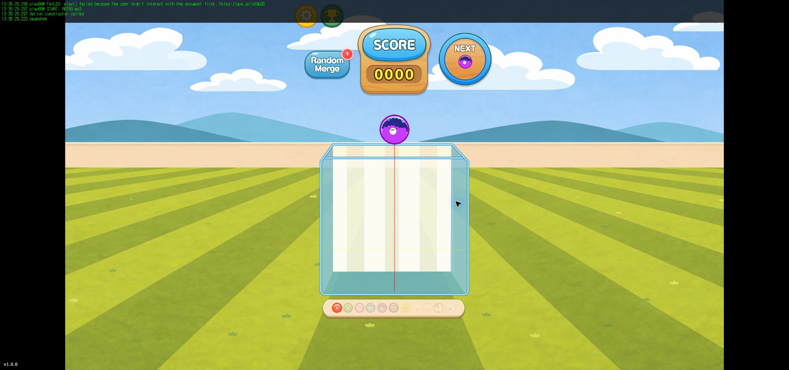
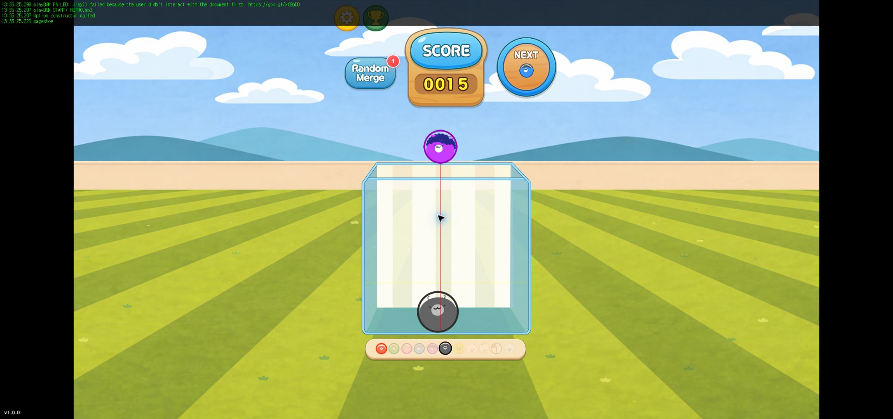

# 플레이 구조 정리 — 2026-10-06

이번 정리는 게임 규칙을 새로 만드는 작업이 아니라, 한 View에 모여 있던 책임을 나누는 작업이다. 기존 `EVT_HUB_SAFE` 통신을 계속 사용한다.

## 이전 코드

- [before-src.zip](before-src.zip): 수정 전 `src` 전체 53개 파일. 사용하지 않는 intro도 포함한다.
- [before-package.json](before-package.json): 테스트 명령 추가 전 package.json.
- [before-files.json](before-files.json): 원본 파일 SHA-256과 기준 커밋. 압축을 풀면 `src/`가 나온다.

## 폴더가 이렇게 바뀌었다

```text
src/
  util/UIScale.ts
  scene/play/
    PLAY.ts                    # 진입점, 씬 수명, 인증/세션 시작
    Controller.ts              # 기존 입력 연결
    View.ts                    # 모든 화면 컴포넌트의 조립/표시 연결부
    Model/
      PlayModel.ts             # 낙하, 병합, 점수, 경고/게임오버 판단
      PlayRules.ts             # 기존 반지름/점수/사운드/시간 값
      PlayPresentation.ts      # Model이 요청하는 화면 작업의 타입
    engine/
      PlayPhysics.ts           # Matter 엔진, 벽, 바디 생성/제거, 충돌 연결
    View/
      persistent/              # 상시 화면 구성
        BackgroundView.ts
        Box.ts
        FruitView.ts
        BaseLineView.ts
        NextCh.ts
        ScoreLine.ts
        RandomMerge.ts
      conditional/             # 상황에 따른 표시와 피드백
        GameOverLineView.ts
        WarningOverlay.ts
        Score.ts
        MergeEffectView.ts
        Result.ts
      options/
        Option.ts
        OptionBtn.ts
        RankingBtn.ts
        ChangeBgm.ts
```

`Score`는 요청한 그룹에 넣었지만 기존 점수판을 숨기지는 않았다. 점수판은 계속 보이고, 점수 증가 연출이 조건부로 표시된다. `ChangeBgm`의 주석 처리된 코드는 이번에는 위치만 옮겼다.

## 이전과 이후

| 이전 | 이후 |
|---|---|
| View에서 Matter 엔진/벽/바디를 관리 | PlayPhysics가 관리 |
| View가 병합·점수·게임오버를 판단 | PlayModel이 판단 |
| View가 과일 MovieClip까지 직접 관리 | FruitView가 표시/동기화/표정을 관리 |
| buildBaseLine에서 선과 현재 과일을 생성 | BaseLineView로 추출 |
| buildGameOverLine에서 경고선을 생성하고 점멸 | GameOverLineView로 추출 |
| PLAY가 개별 UI를 하나씩 생성 | 중앙 View가 UI를 조립하고 PLAY는 Model/View/Controller를 연결 |
| View에 로그인 ID/세션 필드와 로그인 구독 존재 | 인증은 PLAY에 유지. 사용하지 않던 View의 필드와 구독 제거 |
| options가 별도 scene 폴더 | play/View/options로 이동 |
| UIScale이 ui 폴더 | util로 이동, 실제 사용하는 import 갱신 |
| 영상 인트로·로그인/프로필 화면 코드가 남음 | 현재 Main에서 참조하지 않는 scene/intro 전체 제거 |

현재 로딩 창은 `index.html`의 LoadingScreen과 App의 리소스 로딩이다. 영상 intro와 다른 기능이므로 유지했다. 현재 사용하는 AuthService, Firebase, CrazyGames 인증도 유지했다. 공유 리소스/영상 파일과 이벤트 허브의 과거 이벤트 이름은 삭제하지 않았다.

## 통신과 동작

`SCORE_UPDATED`, `GAME_OVER`, `WARNING_ON/OFF`, `MERGE_REQUEST/SUCCESS/FAIL/RESET`, `SESSION_STARTED` 등 기존 이벤트 이름과 payload를 유지한다. 이벤트 허브 파일은 수정하지 않았다.

입력은 Controller → 중앙 View의 기존 interaction 메서드 → PlayModel로 이어진다. Model은 기존 허브 이벤트를 보내고, 화면 내부 작업은 작은 PlayPresentation 인터페이스를 통해 중앙 View에 요청한다. 새 이벤트 버스를 만들거나 내부 렌더링까지 전부 전역 이벤트로 바꾸지는 않았다.

과일 반지름, 점수표, 중력 3, 낙하 쿨다운 1초, 게임오버 대기 4초, 무작위 과일 선택 방식, 화면 좌표와 색상은 기존 값을 옮겼다. 일반 충돌 병합과 아이템 병합은 바디 제거/점수 계산을 공유하지만 기존 이벤트 발생 순서와 차이는 유지한다.

## 함께 정리한 수명 관리

- Controller의 CreateJS 입력 등록/해제를 같은 함수 참조로 연결했다.
- Model의 MERGE_REQUEST/TIME_OUT 구독과 낙하 타이머를 dispose에서 해제한다.
- Score/NextCh/옵션·랭킹 버튼/RandomMerge의 구독과 resize를 해제한다.
- RandomMerge 싱글턴은 유지하되 해당 화면을 폐기할 때 비운다.
- 과일·점수·아이콘의 트윈, 표정 타이머, 경고 스타일, 옵션 스타일과 DOM을 정리한다.
- PLAY.onUnmounted에서도 dispose를 호출한다. 이전 비동기 시작 콜백이 새 게임을 시작하지 않도록 세대 번호를 확인한다.

## 확인한 것

- `npm run build`: 통과.
- `npm run test:refactor`: 5개 통과. 이동 범위/쿨다운, 같은 과일 중복 병합 방지, 랜덤 병합 성공·실패, 낙하 중 제외/4초 게임오버, 구독·타이머 해제를 확인한다.
- 실제 Chrome에서 로딩 종료, HUD, 낙하, 병합/점수, 옵션 열기·닫기, 종료→결과→재시작을 확인했다.
- 종료·재시작 5회 뒤 결과 컨테이너 1개, 게임 버튼 3개, 스타일 수가 유지됐고 브라우저 error 로그가 없었다. 검증 전용 종료 버튼 1개는 테스트 페이지에만 있다.
- 브라우저 검증의 인증/랭킹/아이템 저장은 로컬 대체 구현을 사용했다. 실제 Firebase 쓰기나 서버 운영 검증, Android 실기기 검증은 하지 않았다.
- 전체 `tsc --noEmit`은 아직 실패한다. 기존 75개 진단이 24개로 줄었고 남은 항목은 기존 core/manager/Firebase/Main2/TimeOut 코드의 미사용 선언과 WebFont 타입이다. 새 play 코드와 이동한 View에서 추가 타입 오류는 없다. [남은 진단](typecheck-remaining.txt)

## 화면 참고

과일 미리보기는 매번 무작위이므로 그림의 과일 종류는 다를 수 있다. 기존 배치와 표시를 유지했는지 확인하기 위한 캡처다.






### 타입 검사 추가 확인

편집기에서 TypeScript 6 계열을 사용하면 프로젝트의 5.9.3과 기본 설정이 달라집니다. 6에서는 `strict` 기본값이 true이고 전역 `@types` 자동 포함 기본값이 빈 배열입니다. 기존 검사 수준을 `strict: false`로 명시하고 CreateJS/Node 타입을 명시했습니다. `.vscode/settings.json`은 프로젝트에 설치된 TypeScript 사용 경로를 지정합니다. VS Code가 선택을 요청하면 workspace 버전을 사용하세요. ES5 출력과 downlevelIteration은 유지했습니다.

새 Model의 미리보기 큐, 무작위 병합 선택, 과일 반지름에 실제 존재 검사를 넣고 사운드 테이블의 없는 항목을 처리했습니다. 정상 과일 선택과 병합 규칙은 유지됩니다. 설정에서 strict 검사를 꺼 둔 것과 별개로 이 파일들은 strictNullChecks를 켜서 재검사합니다. 전체 strict 전환과 기존 미사용 코드 정리는 이번 수정 범위에 포함하지 않습니다.

### Result 추가 정리

Result의 책임 분리와 소스 서식 정리는 [추가 변경 설명](result-refactor.md)에 기록했습니다. 이번 수정 직전 소스도 별도로 백업했습니다.
