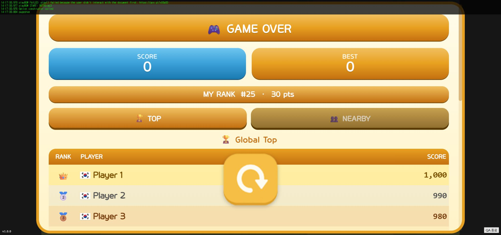
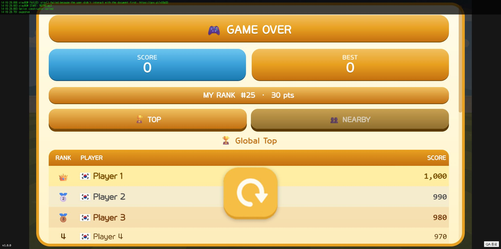

# Result 책임 분리와 소스 정리

이전 Result.ts는 결과 화면, 사용자·점수 상태, 랭킹 조회, 저장 요청, 버튼 입력, 연출을 한 클래스에서 처리했습니다. 이번에는 기존 동작을 유지하며 역할별로 옮겼습니다.

| 파일 | 역할 |
| --- | --- |
| View/conditional/Result.ts | Model·View·Controller 조립과 해제 |
| Model/ResultModel.ts | 사용자·점수·랭킹 조회·페이지 상태 |
| Model/ResultTypes.ts | 결과 데이터와 조회·입력 인터페이스 |
| Controller/ResultController.ts | 이벤트 구독, 점수 저장 요청, 탭·닫기·재시작 연결 |
| View/conditional/result/ResultView.ts | 결과 패널과 버튼 표시 |
| View/conditional/result/RankingView.ts | 랭킹 표와 행, 더 보기 버튼 표시 |
| View/conditional/result/ResultEffects.ts | 등장·신기록 연출과 정리 |

View는 API나 이벤트 허브를 직접 호출하지 않고 받은 데이터를 표시합니다. Controller가 기존 EVT_HUB_SAFE 이벤트를 연결하고, Model이 기존 API_CONNECTOR를 통해 조회합니다. 기존 new Result()와 dispose() 사용법도 유지했습니다.

게임오버 → REQUEST_COLLISION_SAVE → 기존 API의 SHOW_RESULT 흐름과 이벤트 데이터는 유지했습니다. 최종 점수·최고 점수 카드, TOP·주변 순위 탭, 랭킹 전용 모드, 닫기·재시작, 등장·신기록 연출도 유지했습니다. 첫 랭킹 조회에서 페이지 커서를 받지 않아 더 보기 버튼이 비활성인 기존 동작은 그대로입니다. 페이지 조회 API나 서버 저장 정책은 변경하지 않았습니다.

조회 응답이 탭 전환·화면 닫기·게임 해제 이후 도착하면 화면을 덮지 않습니다. 해제 시 이벤트 구독, 창 크기 리스너, 닫기·신기록 타이머, 파티클을 정리합니다. 닫기 전환 중 즉시 다시 열면 이전 닫기 타이머도 취소합니다.

src의 영어로만 작성된 코드 주석 210개를 제거하고, Prettier로 줄 배치를 정리했습니다. 메서드 사이에는 빈 줄을 두었습니다. 기존 한국어 주석은 유지했고 새 코드 주석은 추가하지 않았습니다. 이전에 수정하지 말라고 요청한 EVT_HUB.ts, SafeEventHub.ts, EVT.ts는 내용·서식 모두 그대로입니다. 외부 라이브러리 js, 생성 리소스 static, 이전 백업은 정리 대상에서 제외했습니다.

[이번 수정 직전 소스 백업](before-result-refactor-src.zip) · [이전 package.json](before-result-package.json) · [이전 lockfile](before-result-package-lock.json)

검증: 기존 게임 테스트 5개와 결과 화면 테스트 4개가 통과했습니다. 결과 테스트는 저장 요청 데이터, 랭킹 모드, 늦은 주변 순위 응답, 해제 이후 응답, 반복 구독 해제, DOM 버튼·탭·연출 정리를 확인합니다. npm run test:refactor로 실행할 수 있습니다. DOM 검증에 기존 Parcel이 사용하던 jsdom 14.1.0을 개발 의존성으로 명시했습니다.

브라우저에서는 실제 리소스와 물리 엔진을 쓰고 인증·Firebase만 로컬 대체 서비스로 바꿔 확인했습니다. 분리 전후 카드·표·버튼 배치와 글자 크기를 비교하고, TOP·주변 순위 전환, 랭킹 전용 화면 열기·닫기, 게임오버·재시작 3회에서 결과 컨테이너가 하나씩 유지되는 것을 확인했습니다. 실제 서버나 Android 기기 검증은 포함하지 않았습니다.

빌드는 통과했습니다. 전체 타입검사는 기존 미사용 코드와 WebFont 선언 관련 오류 24개가 남습니다. 이번에 분리한 Result 파일에는 strictNullChecks를 켠 검사에서도 오류가 없습니다. 서식만 바꾼 기존 52개 파일은 구문 트리를 비교해 실행 코드가 바뀌지 않았음을 확인했습니다.

